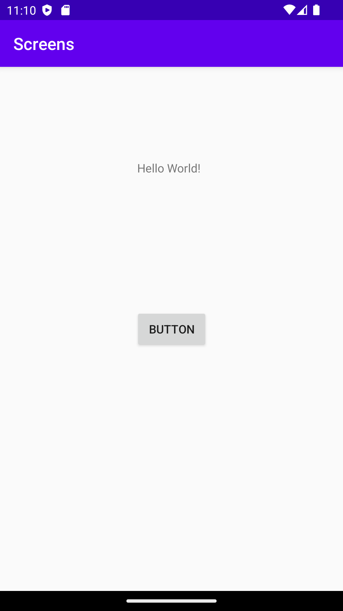
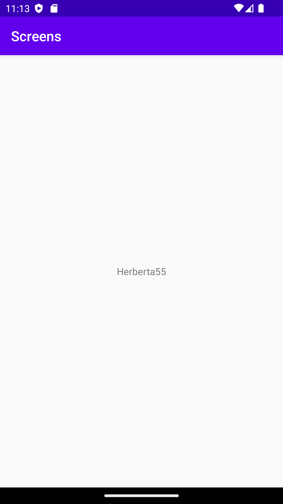

# Rapport
La till en ny activity i layout mappen. I activity_main implementerades en knapp med constraints.
En "OnClickListener och "intent" för knappen implementerades som gör att när man trycker på knappen så kommer man till "SecondActivity" och 2 data typer skickas med.
Se koden nedan för detta.
btn.setOnClickListener(new View.OnClickListener() {
    @Override
    public void onClick(View v) {
        Bertil = new Intent(MainActivity.this, SecondActivity.class);
        Bertil.putExtra("name", "Herberta");
        Bertil.putExtra("number", 55);
        startActivity(Bertil);
    }
});
En widget i second activity implementerades som är en textview. Constraints las till på den. 
Sedan för att göra så att denna textview tar emot de 2 datatyper som skickas från MainActivity behövdes koden nedan.
En string(name) och en integer(number) tas emot och sedan skrivs de ut i en textview i activity_second.
setContentView(R.layout.activity_second);
Bundle extras = getIntent().getExtras();
if (extras != null) {
String name = extras.getString("name");
int number = extras.getInt("number");
textview= findViewById(R.id.textView2);
textview.setText(name+number);
// Do something with the name and number

}
Nedan i Screenshot 1 kan man se activity_main, trycker man på knappen(button) 
så kommer man till activity_second som visas i Screenshot 2.

Screenshot 1 activity_main

Screenshot 2 activity_second